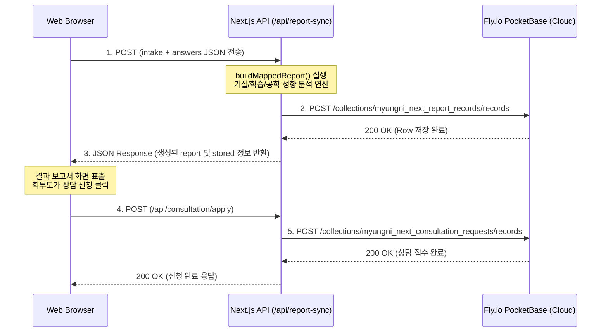

# 📑 명리넥스트(myungni_next) 종합 기술 명세서 (Technical Specification)
> **Myungni Next: Full Technical Services, Database Schemas, Deployment URLs & E2E Workflows**
>
> 본 기술 명세서는 **이기욱 대표님**이 부재한 상황에서도, 다른 모든 개발자나 엔지니어가 본 웹 애플리케이션의 연동 구조, 데이터베이스 컬렉션, 배포 파이프라인, 데이터 흐름을 즉각 파악하고 100% 무결점으로 관리 및 운영할 수 있도록 작성된 종합 인프라 가이드라인입니다.

---

## 1. 🌐 전체 기술 사이트 및 주소명 (Technical Services & URLs)

본 플랫폼을 구성하고 배포하는 모든 인프라 사이트와 실시간 서비스 주소 목록입니다:

### [A] 웹 애플리케이션 플랫폼 (Web Application)
* **프레임워크**: Next.js 16.2.4 (Turbopack 초고속 빌드 모드 탑재)
* **로컬 웹서버 실행 주소**: [http://localhost:3000](http://localhost:3000) (또는 `http://127.0.0.1:3000`)
* **클라우드 호스팅 서비스**: **Vercel** ([https://vercel.com](https://vercel.com))
* **실제 웹서버 배포 도메인**: [https://myungni-jinro.vercel.app](https://myungni-jinro.vercel.app)

### [B] 데이터베이스 엔진 (Database Engine - Fly.io 공용 인스턴스)
* **데이터베이스**: **PocketBase** ([https://pocketbase.io](https://pocketbase.io))
* **클라우드 DB 호스팅 서비스**: **Fly.io** ([https://fly.io](https://fly.io))
* **클라우드 DB 실시간 주소 (Production)**: [https://suprima-platform-pb.fly.dev](https://suprima-platform-pb.fly.dev)
* **클라우드 DB 관리자 대시보드 (Production Admin)**: [https://suprima-platform-pb.fly.dev/_/](https://suprima-platform-pb.fly.dev/_/)
  - *참고*: Suprema Platform 서비스와 동일한 Fly.io 클라우드 PocketBase 인스턴스를 공유하며, 접두사(`myungni_next_`)를 사용하여 테이블 간 충돌을 방지합니다.

### [C] 소스코드 저장소 및 형상관리 (VCS)
* **형상관리 서버**: **GitHub** ([https://github.com](https://github.com))
* **원격 저장소 경로 (Repository)**: `ipsicreator/myungni_jinro`
* **기본 배포 브랜치 (Target Branch)**: `master`
* **배포 파이프라인 (CI/CD)**: Vercel - GitHub Webhook 자동 연동 (Master 브랜치로 `git push` 발생 시 100% 자동 무중단 빌드 및 릴리즈 완료)

---

## 2. 🗄️ PocketBase 컬렉션 및 데이터 스키마 상세

명리넥스트 서비스에서 설문지 응답 내용, 결과 보고서 내역, 상담 신청 이력을 영구 보존하기 위해 사용되는 PocketBase 테이블(컬렉션) 정보입니다.

```
Myungni Next PocketBase Schema Map
├── myungni_next_report_records (진단 결과 보고서 이력 보존)
└── myungni_next_consultation_requests (학부모 상담 신청 내역 적재)
```

### [A] `myungni_next_report_records` (결과 보고서 적재 컬렉션)
* **역할**: 진단 완료 후 생성되는 보고서 결과 데이터 및 설문지 원본 응답 보존
* **주요 필드**:
  - `report_id` (Text, Unique): 생성된 보고서 고유 UUID
  - `student_key` (Text): 중복 방지 학생 키 (`이름|생년월일|전화번호` 해시 결합 구조)
  - `student_name` (Text): 학생 이름
  - `school` (Text): 학교명
  - `grade` (Text): 학년
  - `source` (Text): 유입 소스 (`ipsi-dna-prism-next` 등)
  - `createdAt` (DateTime): 레코드 생성 시각 (ISO 8601 형식 준수)
  - `headline` (Text): 기질 핵심 진로 헤드라인 요약구문
  - `report_json` (JSON): 유형 결과, 추천 역량, 맞춤형 멘토링이 포함된 전체 MappedReport 오브젝트
  - `answers_json` (JSON): 기질 진단(abc), 학습 습관(learning), 공학 적성(engineering) 설문 응답 원본

### [B] `myungni_next_consultation_requests` (상담 신청 컬렉션)
* **역할**: 종합보고서 열람 화면에서 학부모가 요청한 오프라인 컨설팅 상담 신청 내역 적재
* **주요 필드**:
  - `report_id` (Text): 연계된 진단 보고서 ID
  - `parent_name` (Text): 신청 학부모 성함
  - `phone` (Text): 연락처
  - `question` (Text): 사전 상담 요청 기입 문항
  - `preferred_date` (DateTime): 희망 상담 일시
  - `status` (Text): 상담 진행 단계 (`pending`, `completed` 등)

---

## 3. 🔄 End-to-End 데이터 및 API 연동 흐름



---

## 4. ⚡ 24/7 서비스 점검 및 유지보수 명령어 족보 (Cheat Sheet)

본 서비스의 정상 작동성(24/7 구동)을 원격으로 고속 자동 점검할 수 있는 스크립트 명세입니다.

### [A] Vercel 실서버 화면 & 라우트 스모크 테스트
로컬에서 개발 서버를 띄우지 않고, 배포된 실서버가 24/7 가동되는지 및 화면 누락 여부를 5초 만에 점검하는 자동화 명령어입니다:
```bash
# Vercel 라이브 사이트 화면 7종(first-screen, questionnaire, report 등) 일괄 검증
node scripts/qa-vercel-smoke.mjs
```

### [B] Fly.io PocketBase 실서버 API 연결 및 데이터 적재 확인
실제 클라우드 데이터베이스 API가 차단되지 않고 데이터를 정상 입출력하고 있는지 점검합니다:
```bash
# Fly.io PocketBase API 및 컬렉션 권한 상태 검증
node scripts/check_prod_db_pocketbase.mjs
```

### [C] Git 배포 절차 (Vercel 자동 CI/CD 트리거)
```bash
# 1. 수정 파일 전체 스테이징
git add .

# 2. 커밋 메시지 작성
git commit -m "chore: complete 24/7 cloud health configurations & technical reports"

# 3. 원격 마스터 브랜치 푸시 (자동 빌드 및 라이브 무중단 배포 시작)
git push origin master
```

---
**보고서 문서 인덱스**: `MYUNGNI-TS-2026-V1`  
**인증 배포처**: Suprema AI Engineering Council  
**유지보수 담당 그룹**: Myungni Next DevOps Team & Antigravity
